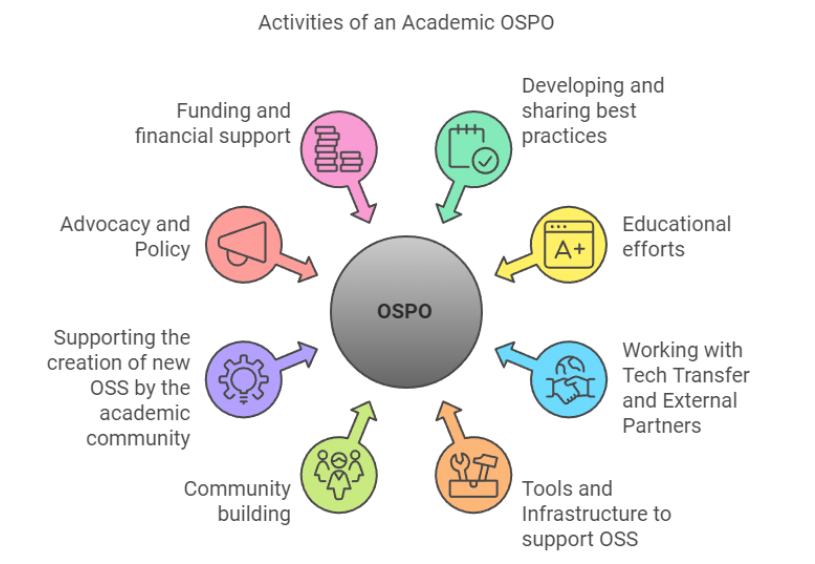

# UCL's Open Source Programme Office

*Executive Summary*
> help them understand the project’s purpose, benefits and implications. Some components of an executive summary include the project overview, business need, proposed solution to the need, cost estimate, return on investment, risks, timeline and a call to action.

## Context

> context for your project, explaining the problem that it's meant to solve and how it aligns with the organisation's vision and strategic plan

UCL has a long history of open-source software development for research and open-source educational materials.

In a recent study, we identified more than a thousand open-source projects owned[^1] by the UCL community that are directly related to UCL research, publications, or teaching on the GitHub platform.
The oldest of these projects dates back to 1997, notably before the invention of git itself, and is still one of our most active projects today.

[^1]: Where "owned" simply denotes project ownership: open source development work done by UCL staff in aid of UCL research or education.

## What is an OSPO?

An Open Source Programme Office (OSPO) is a body within an organisation to look after their open source strategy and operations. OSPOs has been widely adopted in the commercial world[^OSPO-commerce], governmental institutions and world organisations[^OSPO-public]. More recently, various academic and research institutions have also found the value of having OSPOs. Focusing on the latest, we can find research centres such as [CERN][ospo-cern] or [Space Telescope Science Institute][ospo-stsci] and universities like [Johns Hopkins][ospo-jhu] (first one, since 2019), [University of California][ospo-uc] and [Carnegie Mellon University][ospo-cmu] to name a few from US, whereas in Europe we've got universities like [Trinity College Dublin][ospo-tcd] in Ireland, [University of Luxembourg][ospo-snt] and [ETH Zurich][ospo-eth] in Switzerland.

<!-- Footnotes -->
[^OSPO-commerce]: The two biggest OSPO networks in industry are: [OSPO Alliance][ospo-allience] supported by the [Eclipse Foundation][eclipse] and [TODO Group][ospo-todogrp] supported by the [Linux Foundation][LF]. In a [report published in 2024 by the TODO Group][state-of-ospo-2024], it's found that 77% of large organizations have an OSPO (DOI: 10.70828/FXMR3018). <!-- typos: ignore -->
[^OSPO-public]: Covering this space there is the [EU OSPO Network][ospo-eu] lead by the [EC OSPO][ospo-ec] and the [Public Sector OSPOs Network][ospo-public]. They include OSPOs from [United Nations][ospo-un]; from country wide like [France government][ospo-fr] or the [Netherlands](https://opensourcewerken.nl/); cities such as [City of Paris][ospo-paris] or [Munich][ospo-munich]; and specialised public organisations like [Digital Service at the Centers for Medicare and Medicaid Services in US][ospo-cms].
<!-- End Footnotes -->

Though the goals of organisations across these domains differ when establishing an OSPO, they create a fabric that helps those organisations to collaborate and combine efforts to maximise the impact (and support) of open source software. Some activities that an OSPO may do are:

- To advocate for Open Source practises between an organisation through community engagement;
- To measure usage and dependency on open (and closed!) source software/hardware to increase impact and reduce risks;
- To promote, guide and educate internal and external community members on open source culture from technical, social, political and economical perspectives;
- To push policy forward that safeguards open source and protects technological sovereignty of the institution.

*Figure 1: Activities of an Academic OSPO - From [Young, et al. (2024)][young-2024] - Licensed under CC-BY*

Those activities, however, are not new to OSPOs. Over the years, different groups within organisations or wider institutions have been engaging on some of those activities. For example, Oxford University had a group named [OSS Watch][oss-watch] between 2003-2014 that provided unbiased advice and guidance on the use, development, and licensing of free software, open source software, and open source hardware. Similarly, the [Software Sustainability Institute][ssi] has been advocating for better software practices in research across the UK since 2010.

A more detailed definition of an academic OSPO can be found in [Young, et al. (2024)][young-2024]

[LF]: https://www.linuxfoundation.org/
[eclipse]: https://www.eclipse.org/
[ospo-allience]: https://ospo-alliance.org/
[ospo-cern]: https://opensource.web.cern.ch/
[ospo-cms]: https://cms.gov/digital-service/open-source-program-office
[ospo-cmu]: https://www.library.cmu.edu/services/ospo
[ospo-ec]: https://interoperable-europe.ec.europa.eu/collection/ec-ospo
[ospo-eth]: https://transfer.ethz.ch/researchers/oss.html
[ospo-eu]: https://static-page-bdf202.usercontent.opencode.de/
[ospo-fr]: https://code.gouv.fr/
[ospo-jhu]: https://ospo.library.jhu.edu/
[ospo-munich]: https://opensource.muenchen.de/ospo.html
[ospo-paris]: https://opensource.paris.fr/
[ospo-public]: https://floss-pso.network/
[ospo-snt]: https://www.uni.lu/snt-en/
<!-- FIXME: STSci appears on archived OSPO++ page, but no link -->
[ospo-stsci]: http://www.stsci.edu/
[ospo-tcd]: https://www.tcd.ie/innovation/for-trinity-innovators/open-source-programme-office/
[ospo-todogrp]: https://todogroup.org/
[ospo-uc]: https://ucospo.net/
[ospo-un]: https://undp.org/digital
[oss-watch]: http://oss-watch.ac.uk/
[ssi]: https://www.software.ac.uk/
[state-of-ospo-2024]: https://www.linuxfoundation.org/research/ospo-2024
[young-2024]: https://doi.org/10.5281/zenodo.13910682
## Why does UCL need an OSPO? / What benefits does it give?

Open Source is a fundamental component of our research and university infrastructure. However, this is usually forgotten and considered as a given. We do not know how much we depend on it. Equally, we know very little about the social, research, and economic impact that the open source code generated by the UCL has. Contributing to Open Source projects requires more than technical knowledge, it is tied to social and economic aspects, and an OSPO helps to make it more accessible. An OSPO in UCL will benefit the following areas:

- research
  - Provide guidance with sustainability, community engagement and licensing.
- education
  - Train students and staff on the use and contribution of Open Source projects.
  - Promote Open source alternatives to tools taught on courses to allow learners improve skills when losing access to closed source tools
- infrastructure (HPC, Moodle, Portico, HR & Finances, Department administration)
  - Provide support to open source tooling
  - Enable cross-department collaboration
- community
  - Ease collaboration with different institutions for similar tasks (from research software to infrastructure)
- policy
  - Include Open Source solutions and technical sovereignty into UCL procurement,
- impact
  - metrics - what's created within/with help from UCL, what are we depending on. Attract funding and collaborations
  - skills promoted will help students employment while also attract talent from open source communities
  - gain technical sovereignty

*mission statement*
> You’ll need to define your project vision, goals and objectives.

Publicly available and licensed reusable material is increasingly understood as a research output or project deliverable.

*explain how it fits a niche or serves a need*

> What is the risk of not having one?

A major risk that an OSPO mitigates is a legal one.
One of the mandates of an OSPO is to develop an informed organisation-wide strategy for licensing open source projects and to provide guidance to developers and maintainers.
In our study, we noted 36.1% of UCL's open-source projects are unlicensed.

It will be harder to support our community with what they need, they will reinvent rather than collaborate.

## How would it work at UCL?

### Plan 

- 3-year plan, 5-year plan, beyond

*project definition*
> provide general information about your projects, such as the business objectives that will be achieved and the project plan outline. It offers a comprehensive overview of the project including its objectives and scope. Here, include details such as the objectives, stakeholders, scope, expected outcomes and constraints.

*project plan*
> Figure out the tasks you’ll have to take to get the project done. Estimate how long it will take to complete each one.

*risk assessment*
> identify and analyse the risks associated with your project activities. From there, you can assess the likelihood and impact of each and rank them based on this information. The risk assessment makes it easier to focus on the most pressing risks and includes a mitigation strategy to reduce the impact in case the risk comes to fruition.
#### Activities 

- Define the governance structure for year 2 onwards
  - how is formed, how is renovated, how are decisions taken
- Continue and augment OSS metrics at UCL
  - Add more OSS projects we've find developed within UCL
  - Measure citations to OSS from publications
  - Start measuring UCL contributions to external maintained projects
  - Generate reports every 6 months of impact (what we create, what we contribute to, what we use)
	- Separate between research, infrastructure,
    - Report on risks of dependencies/sustainability
  - Measure Open Source dependencies of closed source software
    - this will require access to organisations and repositories we may not have at the moment and stakeholders will need to promote the need.
    - This is also an important security exercise (ISG must be involved)
- UCL-wide survey to understand the OS landscape and the needs of the community
  - Design based on surveys run by other universities
  - Users ([University of Wisconsin Madison results][uw-survey]), contributors ([University of California results][uc-survey])
- Publish a guidance on how to release open source outcomes within UCL
  - Including license, development models, community engagement, and commercial opportunities
  - Outcomes such as: software, hardware, data, educational resources, 
  - Ideally work with Library, Arena/DigiEd, UCLB and UCLC. Probably Institute of Making too.
- Education. Make a call with all educators across UCL that uses OS in their modules/classes
  - Find out what support they need
  - Catalogue and highlight on the website those courses
- Education - collaboration
  - Promote collaborations on students project with open source communities (e.g., master projects) (AIDE and SoftEng master programmes may be ready from 2026-2027)
  - Support participation on Summer of Code programmes
- Education - Skills development
  - Create and deliver series of short courses/workshops covering Open Source basics (what's it, meaning of licensing, how to contribute,...)
  - Hackathon - find partners wot work with, e.g., UN Hackathon, NASA Open Science, ...
- Community
  - Support and promote community initiatives (Linux user group, Latex user group, Python Community of Practice, R Users, ..)
  - Working with funding bodies and external stakeholders to promote Open Source, such as UKRI, DiRAC, Software Sustainability Institute, ...
 - [Open Science awards][osci-award] people at UCL (they've got a software component)
  - Strength ties with OS networks, CURIOSS, CHAOSS, and support other universities that they want to create an OSPO.
  
  
[uw-survey]: https://uw-madison-dsi.github.io/open_source_survey_results/
[uc-survey]: https://www.youtube.com/watch?v=fFoLmb6o7Z8
[uc-survey-abs]: https://web.archive.org/web/20250905052446/https://2025.fossy.us/schedule/presentation/334/
[osci-award]: https://www.ucl.ac.uk/library/open-science-research-support/open-science/about-office-open-science-scholarship/ucl-open-science
*project scope*
> all the tasks and deliverables that will be executed in your project to reach your business objectives

*project schedule*
> a timeline for the project by estimating how long it will take to get each task completed. Gantt chart

*Marketing Strategy*
> distribution channels, pricing, target customers, among other aspects of your marketing plan or strategy.

#### Resources
*project budget*
> Your budget is an estimate of everything in your project plan and what it will cost to complete the project over the scheduled time allotted. Personnel costs, software or hardware costs, consulting fees, training costs and contingency funds

*Financial Appraisal*
> explain how the financial benefits outweigh the project costs.

### Organisation

*Project Governance*
> ll the project management rules and procedures that apply to your project. For example, it defines the roles and responsibilities of the project team members and the framework for decision-making.

The UCL OSPO will comprise a core team from ARC and _at least one_ delegated representative from each team or department in the university that has a stake in open source.

These teams are:
- The Department of Computer Science;
- The Sainsbury Wellcome Centre's Neuroinformatics Unit;
- The Office of Open Science and Scholarship;
- ISD;
- Digital education;
- The Bartlett Centre for Advanced Spatial Analysis;
- and Mechanical Engineering.

The emphasis is on _at least_, because we aim to encourage members from these and other teams to join voluntarily.

Governance to use UCL's structure digital research board (ARC) or the one from Library.

Roles:

working groups

*Communication Plan*
> The communication plan can help foster an atmosphere of transparency and engagement among stakeholders. The plan outlines how, when and what will be communicated so that everyone is informed and has a shared understanding.
*Progress Reports*

### Supporters

## How will we know if this worked out?
*Success Criteria*

## References

- https://www.cni.org/topics/ci/guide-to-set-up-university-open-source-programs-office-ospo
- https://research.redhat.com/blog/article/building-a-university-ospo-bolstering-academic-research-through-open-source/
- https://opensource.com/article/20/10/rit-ospo
- https://opensource.utexas.edu/participation-pathway

# Checklist
- [ ] project’s objectives, 
- [ ] costs and 
- [ ] benefits
- [ ] financial appraisal,
- [ ] proposal,
- [ ] strategy and 
- [ ] marketing plan 
- [ ] offers a full look at how the project will benefit the organization
- [ ] if a project business case is not anchored to reality, and doesn’t address a need that aligns with the larger business objectives of the organization, then it is irrelevant.
- [ ] why, what, how and who of your project.
- [ ] Business problem - aligned with business goals
  - [ ] What's solving? what's the opportunity?
  - [ ]  “Lead with the need.” Your first job is to figure out what that problem or opportunity is, describe it, find out where it comes from and then address the time frame needed to deal with it.
- [ ]  Identify the Alternative Solutions
  - [ ] How do you know whether the project you’re undertaking is the best possible solution to the problem defined above? 
	1. Note the alternative solutions.
	1. For each solution, quantify its benefits.
	1. forecast the costs involved in each solution.
	1. Then figure out its [feasibility](https://www.projectmanager.com/training/how-to-conduct-a-feasibility-study).
	1. Discern the risks and issues associated with each solution.
	1. Finally, document all this in your business case.
- [ ] Recommend a Preferred Solution
  - [ ] a decision matrix to help you prioritize the solutions to best choose the right one.
- [ ] Describe the Implementation Approach
- [ ] Components
  - [ ] Executive summary
  - [ ] Project Definition
  - [ ] Vision, Goals and Objectives (You’ll need to define your project vision, goals and objectives.)
  - [ ] Project Scope
  - [ ] Background Information
  - [ ] Success Criteria and Stakeholder Requirements
  - [ ] Project Plan
  - [ ] Project Budget
  Your budget is an estimate of everything in your project plan and what it will cost to complete the project over the scheduled time allotted. 
  - [ ] Project Schedule (Gantt)
  - [ ] Project Governance 
  - [ ] Communication Plan
  - [ ] Progress Reports 
  - [ ] Financial Appraisal
  - [ ] Market Assessment
  - [ ] Competitor Analysis
  - [ ] SWOT Analysis - identify your organization’s strengths, weaknesses, opportunities and threats.
  - [ ] Marketing Strategy
  - [ ] Risk Assessment

